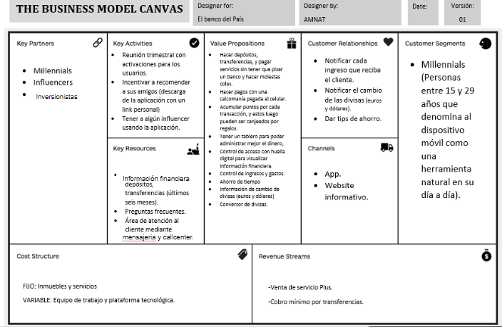
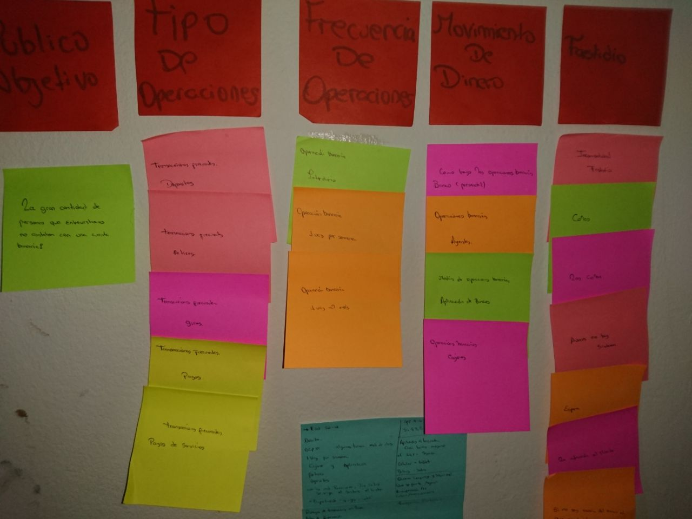
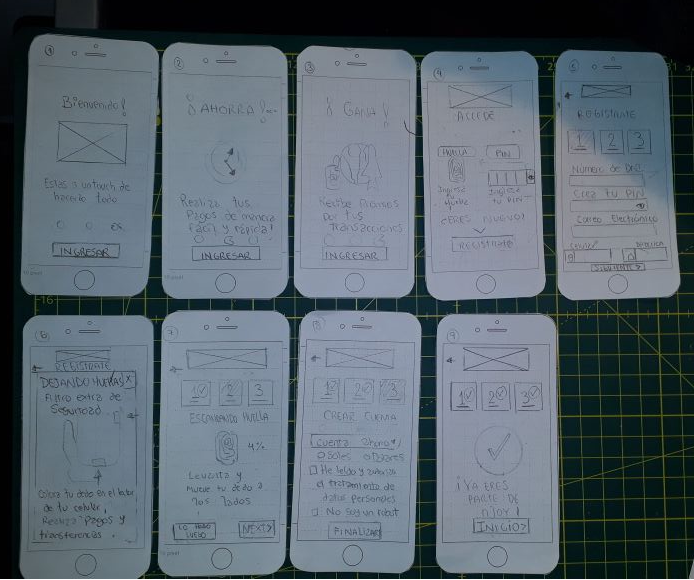

# BANCO DIGITAL PARA MILLENNIALS
Banco 100% digital, siempre tenemos en mente que un banco debe ser aburrido, NJOY cambiará tu perspectiva, no más colas, no más pérdida de tiempo. NJOY donde un banco nunca más será aburrido.

### Banco del Pais
- Es uno de los bancos más reconocido e importante, es una institución de muchos años y actualmente está pasando por un proceso de transformación digital. 

### Objetivo 
- Como parte de este proceso, han implementado un área de innovación que quiere llegar de una mejor manera a los usuarios más jóvenes. Se han propuesto crear un banco 100% digital dirigido para millenials.

### Requerimientos
- Identificar quiénes son los stakeholders de tu proyecto
- Planear una reunión de kick - off detallando
    * Quiénes deberían estar presentes
    * Qué les preguntarías a los presentes 

## STAKEHOLDERS DEL PROYECTO

* CEO
* Gerente de Riesgos
* Gerente de Marketing
* Gerente de IT
* Regulador estatal
* Community Manager
* Jefe de ventas
* Jefe de innovación
* Ejecutivo Corporativo
* Ejecutivo de Afiliación /Tarjetas de Crédito
* Visual Designer
* Product Manager
* Gerente de operaciones.
* Gerente Legal
* UX Designer
* Front-End
* Back-End

## KICK - OFF
(Reunión de lanzamiento de la investigación)

### PARTICIPANTES

Aquellos que nos ayudarán a descubrir sobre los objetivos de la investigación, los usuarios y la plataforma con la que vamos a trabajar. 

* CEO 
* GERENTE DE IT (Da apoyo en la solución de problemas de soporte técnico.)
* FRONT-END DEVELOPER DE BANCO DEL PAÍS 
* BACK-END DEVELOPER DE BANCO DEL PAÍS
* PROJECT MANAGER(Planificará, coordinará y gestionará todas las actividades, recursos y demás elementos que formen parte del proyecto).
* GERENTE DE MARKETING(Desarrolla e implementa las estrategias de marketing a corto y largo plazo de una empresa).
* REGULADOR ESTATAL
* GERENTE DE RIESGOS (Identifica los riesgos del proyecto y los analiza cualitativa y cuantitativamente).
* JEFE DE INNOVACIÓN
* PRODUCT MANAGER

## PREGUNTAS A REALIZAR

* ¿Qué problema voy a resolver?
* ¿Cuáles son los resultados esperados de la investigación ?
* ¿En qué nos diferenciaremos de otros bancos digitales?
* ¿Qué no sabemos de nuestros usuarios?
* ¿Qué preguntas hacer para obtener esa información?
* ¿Cómo podemos obtener más usuarios ?
* ¿Qué información es crucial para los usuarios?
* ¿Qué riesgos se podrían presentar al utilizar el producto?
* ¿Cómo solucionamos esos riesgos?
* ¿Qué medios utilizaremos para llegar a nuestro público objetivo?
* ¿Qué estrategias de marketing podríamos utilizar para lograr los objetivos del negocio?

## BUSINESS MODEL CANVAS 

## RESEARCH PLAN
* **Revisar información obtenida en base a las preguntas** 
	Verificar si la información con la que contamos es suficiente o debemos indagar más.

* **Hacer entrevistas con expertos**
        Preguntas a los Stakeholders para aclarar las dudas existentes.

* **Hacer sesiones de testing del prototipo propuesto**
        
* **Sintetizar los findings** 
        En base a todas las recomendaciones recibidas luego del Kick - off aplicarlas.

## DEFINIENDO EL PRODUCTO

## Guia de entrevistas para usuarios
[Entrevistas](https://docs.google.com/document/d/1xnwaWHZH0gIfjrft_np9M0B1JAwlszksYUuAp5mlVWo/edit?ts=5a99cd17#heading=h.mhocq9xmh2n8)

## User Persona
Definiendo al User Persona

Nombre: Sora
Edad: 21 años
ocupacion: Estudiante de arte
Estado Civil: Soltera
Distrito: La Molina - Lima

Frase: No tengo necesidad de poner mi dinero que gano con pequeñas exposiciones de arte en un banco, ya que es absurdo. Los bancos solo nos hacen pasar malos momentos.

Biografia: Estudiante de arte  y estudia fotografia en las noches, algunos fines de semanas expone sus obras en el garaje de la casa de sus padre, el dinero que gana lo ocupa en viajar a multiples lugares con tal de conseguir inspiracion o las mejores fotografias.

## Analisis en base a las respuestas optenidas
 Segun los datos recolectados pudimos obtener informacion y ordenarlos según categorias.
 
 
 
## Que Ofrece nuestro producto
- Romper con la idea de que el banco es un entorno aburrido que nos causa malestar, es por eso que reinventanto la estructura original nosotros ofrecemos una tematica distinta y unica con tal de que el usuario se vea atraido por una menra distinta a la idea de un banco.
- Cubrir las necesidades basicas de los usuarios que son, Transferencias, Consultas, pagos de Servicios (servicios- instituciones - recargas celular- pago de celulares)
- Tambien ofrecemos comunicarte con un encargado de nuestro banco a traves de videollamadas, dandole la informacion detallada de este encargado para que pueda verificar si realmente se comunica con alguien de nuestra institucion y no sufra ningun tipo de estafa.
- Servicio de Ubicacion que le permitira saber los cajeros mas proximos de su paradero(lugar en el que se encuentra).
- Sistema de objetivos mediante motivaciones.

## Prototipo
- Paper Prototype

## Miembros
- [Nataly Cortes](https://github.com/NatalyCortez)
- [Ambar Ampudia](https://github.com/ambar13)

